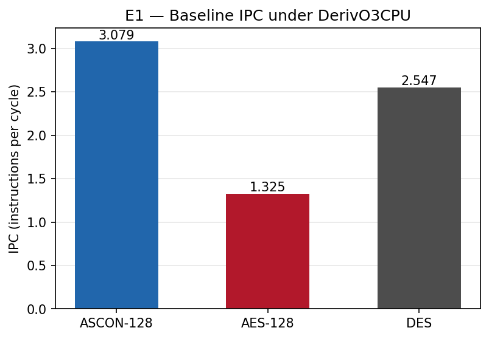
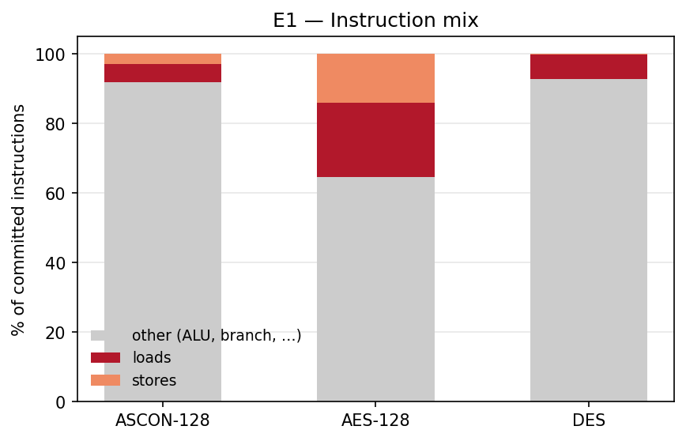
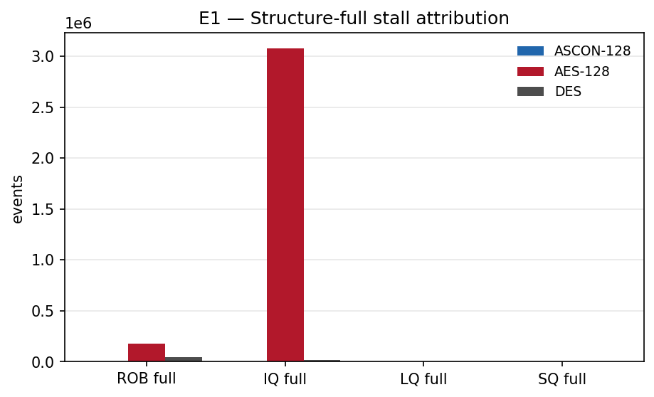
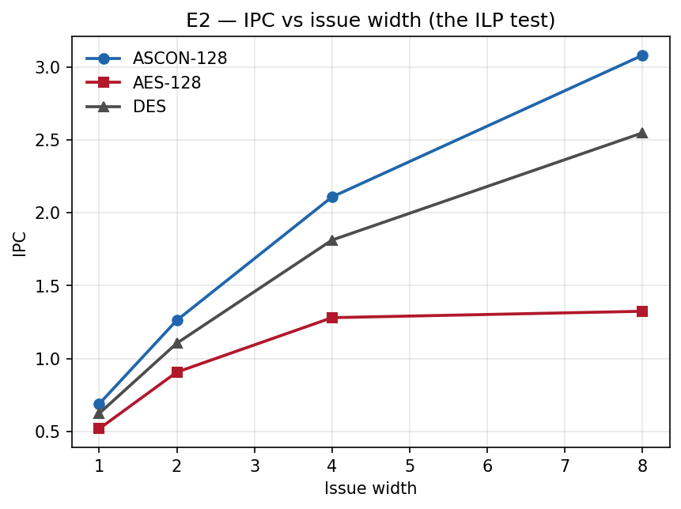
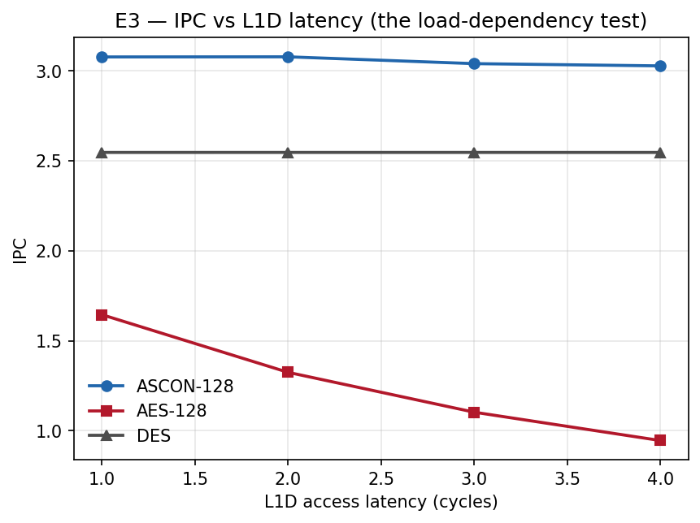

# Where ASCON-128's Advantage Comes From: A Microarchitectural Study

**Kush Mehta** — Institute of Technology, Nirma University
_Complete. E1/E2/E3 run, analysed and written up — see [FINDINGS.md](FINDINGS.md)
for the dated log, including one intermediate hypothesis the data falsified._

> **Drafting rule:** every number in this document must trace to a run in
> `results/`, cited by path. Nothing estimated, remembered, or carried over from
> an earlier project. If a prediction failed, the section says so plainly and
> the abstract reflects it.

---

## Abstract

A January 2026 wall-clock benchmark found ASCON-128 running 78× faster than
AES-GCM across 5,000 IoT payloads; a February 2026 gem5 cache study found
software AES's L1D miss rate flat at 0.14% from 4 kB to 64 kB and concluded
its bottleneck "lies in instruction execution, not memory capacity," without
identifying what in execution. This project isolates that mechanism by
running ASCON-128, software AES-128 (`-mno-aes`, CTR mode), and DES (CTR
mode) under gem5 v25.1's `DerivO3CPU` — an out-of-order model, unlike the
prior study's `TimingSimpleCPU` — across three experiments: a baseline
profile, an issue-width sweep (1/2/4/8), and an L1D-latency sweep (1–4
cycles). The mechanism is not raw load latency, which is identical across
all three workloads (~3 cycles at the baseline L1D config) and confirms the
2026 miss-rate result still holds under O3. It is load *frequency and
position in the dependency chain*: AES commits a load on 21.4% of
instructions versus ASCON's 5.3%, and those loads sit back-to-back on the
round function's critical path with too little independent work to hide
them. That structure produces 178,876 ROB-full and 3,076,715 IQ-full stall
events for AES against 3 of each for ASCON (E1); it caps AES's issue-width
scaling at 2.55× (1→8) against ASCON's 4.46× (E2); and it makes AES's
throughput directly exposed to L1D latency — a 42.5% IPC drop from 1 to 4
cycles, against 1.6% for ASCON and 0.0% for DES (E3). The hypothesis —
ASCON's advantage is primarily an ILP effect, not a memory one — holds
end to end, with one correction: the original framing pointed at load
*latency*; the actual driver is load *density on the critical path*, of
which latency-sensitivity is a downstream symptom, not the cause itself.

## 1. Introduction

A January 2026 wall-clock benchmark loaded ASCON-128 and AES-GCM as compiled
DLLs through Python `ctypes` and timed them across 5,000 IoT payloads:
ASCON-128 ran 78× faster than AES-GCM and 12× faster than DES. That number
establishes *that* ASCON wins decisively, but says nothing about *why* — it
compares a stream cipher's core permutation against a mode (GCM) that adds
GHASH authentication on top of a block cipher, timed through an FFI boundary
that folds call overhead into the result. It is not a clean cipher-versus-
cipher comparison, and it cannot be decomposed into a mechanism after the
fact.

A February 2026 gem5 study went looking for a memory-side explanation and
ruled one out: software AES-128's L1D miss rate stayed flat at 0.14% from a
4 kB to a 64 kB cache, because its 256-byte S-box fits comfortably even in
the smallest cache tested. The study concluded AES's bottleneck "lies in
instruction execution, not memory capacity" — but that conclusion is a
negative result. It says where the answer isn't; it does not say what it
is. It was also run on `TimingSimpleCPU`, a model with no pipeline, so it
could not have supported any claim about instruction-level parallelism even
if it had tried to make one.

This project's scope is narrower than either prior one, deliberately: given
two ciphers compiled the same way, run on the same simulated out-of-order
core, in the same mode, with setup and teardown excluded by ROI markers —
where does the remaining throughput gap come from? It does not attempt to
decompose the original 78× figure; that number is AES-**GCM**, not AES, and
was measured through a different instrumentation path entirely. What
follows explains the mechanism behind a smaller, honestly-measured gap
between ASCON, AES-CTR, and DES-CTR under `DerivO3CPU`, and argues that
mechanism is the same one responsible for the wall-clock result, even
though it does not reproduce that result's magnitude.

## 2. Background

**ASCON-128.** A sponge-construction AEAD cipher: a 320-bit state as five
64-bit words, permuted by a round function built entirely from XOR, AND,
NOT and bitwise rotations (an ARX-style construction) — no table lookups
anywhere in the permutation. The round's five S-box "lines" operate on
mutually independent combinations of the state words, so a wide out-of-order
core has, in principle, five independent chains of work to interleave per
round rather than one serial chain.

**Software AES-128.** The reference "-mno-aes" build implements SubBytes via
a 256-byte lookup table rather than the hardware `AESENC` instruction. Every
byte of every round's state is substituted via a load from that table. A
256-byte table fits in L1D at any realistic cache size — which is exactly
what the Feb 2026 study measured — so the table lookups essentially never
miss. But "essentially never misses" does not mean "free": each lookup is
still a load instruction, with a dependency (the index) computed from the
previous round and a result consumed by the next, occupying a load queue
entry and an L1D access even on a hit. Cache-insensitive is not the same
claim as memory-independent, and Section 4 (E1) is precisely the evidence
for the difference.

**DES.** Included as a third, structurally distinct profile rather than a
second confirmation of AES. This implementation performs its bit
permutations (initial permutation, expansion, P-box) as serial chains of
shift/mask/OR operations on general-purpose registers rather than via
lookup tables — so, like ASCON, it does little memory access, but unlike
ASCON its permutation is a long serial dependency chain rather than several
independent ones. DES tests whether "few loads" alone predicts high IPC, or
whether the amount of *independent* work available also matters — Section
7 (Discussion) addresses this directly.

**Why `DerivO3CPU`, not `TimingSimpleCPU`.** This substitution is the
methodological spine of the project. `TimingSimpleCPU` executes one
instruction at a time with no reorder buffer, no issue queue, and no
instruction-level parallelism of any kind; an IPC number from it can speak
to memory latency but cannot speak to whether a workload's structure allows
independent instructions to overlap. `DerivO3CPU` models fetch, decode,
rename, an issue queue, out-of-order issue, and a reorder buffer — the
minimum machinery needed to ask whether ASCON's structural claim (mutually
independent S-box lines) actually translates into more instructions in
flight than AES's serial load-dependent chain. Every experiment in this
report is only meaningful because of this choice.

## 3. Method

**Shared harness.** All three workloads (`workloads/ascon.c`, `aes.c`,
`des.c`) share one harness (`workloads/harness.h`): identical input buffers,
the same deterministic PRNG seed, the same fixed key and nonce/IV, and the
same output checksum so correctness can be spot-checked alongside
performance. `m5_reset_stats()`/`m5_dump_stats()` bracket the encryption
loop so process startup (static linking, page faults, PRNG seeding) and
teardown fall outside the measured region — every stat quoted in Sections
4–6 is from the ROI-only dump section (`roi_markers=yes` in
`results/parsed.csv`).

**Mode choice.** AES and DES both run in CTR mode; ASCON runs in its native
AEAD mode. All three are therefore keystream-style stream processing rather
than one workload paying for a mode (e.g. CBC's serial chaining) that the
others don't. AES-**GCM** is deliberately excluded from this project's
measurements — its GHASH step is a separate authentication computation
over Galois-field multiplication that would measure GHASH arithmetic, not
the S-box access pattern the hypothesis is actually about.

**Correctness.** All three implementations are checked against published
test vectors before any performance number is taken (`make check` in
`workloads/`): ASCON's NIST LWC known-answer tests, AES against FIPS-197,
DES against FIPS-46-3. `reference/ascon.c` — Kush's original January 2026
ASCON-128 implementation — is kept unmodified as the artifact of that
earlier project; `workloads/ascon.c` derives from it but fixes a
round-constant bug in which the 6-round permutation was using the
constants for the 12-round variant. The fix changes output correctness,
not the instruction mix or memory-access pattern, so it is
microarchitecturally neutral with respect to every claim in this report
(see the 2026-08-29 entry in [FINDINGS.md](FINDINGS.md) for the full
diagnosis).

**Build flags.** All three binaries are built statically
(`-static -mno-aes -fno-tree-vectorize`). `-mno-aes` prevents the compiler
from emitting hardware `AESENC`/`AESDEC`, which would collapse the entire
S-box-access hypothesis into a no-op; this is verified directly against the
committed binary, not assumed —
`objdump -d workloads/bin/aes.gem5 | grep -ci aesenc` prints `0` (see the
2026-09-14 entry in [FINDINGS.md](FINDINGS.md) for the run and its output;
the README documents the check for anyone re-running the build).
`-fno-tree-vectorize`
disables autovectorization so the instruction mix reflects each cipher's
scalar structure rather than a compiler's SIMD rewrite of it; this is a
scope boundary, not an oversight — a vectorised ASCON is a materially
different, and unaddressed, question (see Threats to Validity, Section 7).

**Baseline O3 configuration.** `DerivO3CPU`, issue width 8 (fetch through
commit), 192-entry ROB, 64-entry IQ, 32-entry LQ/SQ, 32 kB L1D at 2-cycle
latency, `backComSize`/`forwardComSize` = 20 (raised from gem5's default 5;
required to avoid an assertion failure at issue width 1 — see
[FINDINGS.md](FINDINGS.md), 2026-08-29). The full parameterisation lives in
`configs/o3_crypto.py`.

**Simulator and determinism.** gem5 v25.1.0.0
(`7a2b0e413d06c5ce7097104abef3b1d9eaabca91`), X86 ISA, SE (syscall-emulation)
mode, run inside an Ubuntu VM under VirtualBox on a Windows 11 host (see
[VM-SETUP.md](VM-SETUP.md) for the host↔VM workflow). Every run uses a fixed
PRNG seed and a fixed key/nonce, so a given `(workload, CPU-parameter set)`
pair produces identical stats on repeat runs — the only run-to-run variance
observed across this project was in wall-clock time (VM scheduling noise,
noted where it matters in FINDINGS.md), never in the simulated statistics
themselves. This holds only when every CPU parameter is actually identical:
`results/raw/calib_ascon` and `results/raw/e1_ascon` are both an unmodified
ASCON baseline run but are *not* the same config in this strict sense — the
calibration run predates the `backComSize`/`forwardComSize` fix (20, from
gem5's default 5; see [FINDINGS.md](FINDINGS.md), 2026-08-29) and so differs
by that one parameter, which is why their `numCycles` differ by 35 out of
2,165,732 (0.0016%) rather than matching exactly. That gap is a real,
understood effect of the parameter change, not simulator nondeterminism; it
is also why the report's own numbers all come from post-fix runs (E1–E3),
never from `calib_ascon`.

## 4. E1 — Baseline microarchitectural profile

Config: `DerivO3CPU`, issue width 8, ROB 192, IQ 64, LQ/SQ 32, L1D 32 kB /
2-cycle, `backComSize`/`forwardComSize` = 20 (see FINDINGS.md, 2026-08-29, for
why). N = 1000 blocks × 64 B. Raw: `results/raw/e1_{ascon,aes,des}/stats.txt`.

| Workload | IPC | L1D miss | L1I miss | Branch mispred | Load frac | ROB-full | IQ-full | LQ-full |
|---|---|---|---|---|---|---|---|---|
| ASCON-128 | 3.079 | 0.0035% | 0.0062% | 3.26% | 5.34% | 3 | 3 | 0 |
| AES-128 | 1.325 | 0.0001% | 0.0012% | 0.40% | 21.40% | 178,876 | 3,076,715 | 0 |
| DES | 2.547 | 0.0003% | 0.0001% | 3.19% | 6.99% | 44,980 | 17,031 | 0 |

(LQ-full is 0 across the board because gem5 25.1 exposes no per-LQ-full
counter at this granularity — `lq_full_events` is the closest available
proxy, not a load-specific stall count; see `scripts/parse_stats.py`.)

ASCON's IPC (3.08) is 2.3× AES's (1.32) at this 8-wide baseline. The
instruction mix is the first piece of evidence: AES commits a load on 21.4%
of instructions, roughly 4× ASCON's 5.3% and 3× DES's 7.0% — consistent
with S-box/T-table lookups being loads. But the L1D miss rates are all
near zero (0.0001–0.0035%), confirming the Feb 2026 finding still holds
under an out-of-order core: AES's 256-byte S-box fits L1 regardless of CPU
model, and cache capacity is not the story.

What separates the workloads is stall attribution, not cache behavior. AES
hit 178,876 ROB-full and 3,076,715 IQ-full events in the ROI region; ASCON
hit 3 of each — background noise. DES, despite committing far more
instructions for the same N (181M vs. AES's 18.5M, because this DES
implementation is bit-permutation-per-bit rather than table-based), hit
44,980 ROB-full and 17,031 IQ-full events — 4× below AES on ROB-full and
180× below on IQ-full, despite an order of magnitude more instructions.
AES's rename stage was blocked ~19% of all cycles; ASCON's, under 0.01%.

Critically, the per-load latency stat (`lsq0.loadToUse::mean`) is
essentially identical across all three workloads at this config — 3.03 /
3.10 / 3.00 cycles for ASCON / AES / DES. AES's individual loads are not
slower than the others'. The mechanism is not load latency; it is load
*frequency and position in the dependency chain* — AES's S-box lookups sit
back-to-back on the round function's critical path often enough (21.4% of
all instructions) that even a uniform 3-cycle latency compounds into
massive ROB/IQ backpressure, because there isn't enough independent ALU
work to issue around them. ASCON's ARX round has the opposite structure:
few loads, and five mutually independent S-box lines to fill the OoO
window while anything is in flight.

## 5. E2 — Issue width sweep

Config as E1, varying only issue width (fetch/decode/rename/dispatch/issue/
wb/commit scaled together; squash width and `backComSize`/`forwardComSize`
fixed). Raw: `results/raw/e2_{ascon,aes,des}_iw{1,2,4,8}/stats.txt`.

| Issue width | ASCON IPC | AES IPC | DES IPC |
|---|---|---|---|
| 1 | 0.690 | 0.520 | 0.625 |
| 2 | 1.263 | 0.908 | 1.106 |
| 4 | 2.108 | 1.281 | 1.813 |
| 8 | 3.079 | 1.325 | 2.547 |

IPC(8)/IPC(1): ASCON 4.46×, DES 4.08×, AES 2.55×. ASCON climbs at every
step, including the last (+83% 1→2, +67% 2→4, +46% 4→8); DES tracks
closely (+77%, +64%, +41%). AES climbs early (+75% 1→2, +41% 2→4) then
flattens (+3.4% 4→8). AES is not issue-width-starved past 4 wide; ASCON and
DES still are, even at 8.

Stall attribution explains where the plateau comes from: AES's ROB-full
events are 0 at issue width 1–2, 46,972 at width 4, and 178,876 at width
8 — the ROB only becomes the binding constraint once the front end stops
being the bottleneck and enough issue bandwidth exists to expose the real
limiter, the dependency chain through the S-box loads (E1). This is
exactly the "ASCON climbs, AES plateaus early" signature the hypothesis
predicted, and it does not by itself distinguish load *latency* from load
*density* as the cause — E3 does that.

## 6. E3 — L1D latency sweep

Config as E1 (issue width 8), varying only L1D tag+data+response latency
together. Raw: `results/raw/e3_{ascon,aes,des}_lat{1,2,3,4}/stats.txt`.
Figure below.

| L1D latency (cyc) | ASCON IPC | AES IPC | DES IPC |
|---|---|---|---|
| 1 | 3.078 | 1.645 | 2.547 |
| 2 | 3.079 | 1.325 | 2.547 |
| 3 | 3.041 | 1.103 | 2.547 |
| 4 | 3.029 | 0.945 | 2.547 |

This is the test that separates the two candidate mechanisms, and the
result is unambiguous: from lat1 to lat4, AES's IPC drops 42.5% (1.645 →
0.945); ASCON drops 1.6% (noise-level); DES is flat to four significant
figures (2.5473 at every point). AES loses 14–20% IPC per added cycle of
L1D latency. ROB-full events climb with it (115,918 → 178,876 → 253,879 →
354,853); ASCON's and DES's stall counts stay pinned near their E1 values
throughout.

`loadToUse::mean` scales 1:1 with the latency knob for all three workloads
alike (AES: 2.11 → 3.10 → 4.13 → 5.12 cycles — the same slope as ASCON and
DES) — the *per-load* cost of latency is not workload-specific. What is
workload-specific is exposure: AES's loads are dense (21.4% of
instructions, E1) and sit on the round function's critical path, so a
shared latency increase compounds into a large aggregate IPC loss. ASCON
and DES don't have that structure, so the same latency increase is nearly
invisible to their throughput. Latency-sensitivity and load-density are not
competing explanations here — density and chain position are *why* AES is
latency-sensitive and ASCON isn't.

## 7. Discussion

Jointly, the three experiments establish a chain of evidence rather than any
one of them alone doing the whole job. E1 rules out cache capacity (miss
rates near zero for all three) and rules out per-load latency (identical
`loadToUse::mean` across workloads) as explanations, and locates the
difference instead in load frequency and stall attribution. E2 shows the
consequence at the resource level: AES saturates the ROB/IQ once issue
width stops being the bottleneck, while ASCON and DES keep scaling. E3
manipulates the mechanism directly rather than the resource that would mask
it, and shows AES's throughput is in fact highly exposed to L1D latency
(42.5% IPC loss over 1→4 cycles) *because* of E1's load-density finding,
not despite it. No single experiment proves the mechanism; together they
triangulate it, each closing a gap the others leave open.

DES is the useful third data point precisely because it reaches the
opposite end of the spectrum from AES for a *different* reason than ASCON
does. ASCON is fast because it has few loads and abundant independent ALU
work. DES has a comparable load fraction to ASCON's (6.99% vs. 5.34%) and
tracks ASCON's issue-width scaling almost exactly (4.08× vs. 4.46×, E2) and
its L1D-latency insensitivity exactly (0.0% vs. 1.6%, E3), yet its absolute
IPC (2.547) sits well below ASCON's (3.079) — bit-permutation-per-bit DES
does far more total serial work per block than either ASCON's five-line ARX
round or table-based AES, so its ceiling is lower even though it is not
memory-bound. This confirms "high IPC" and "few loads" are related but not
identical axes: low load density is necessary for high IPC in this data,
but the amount of independent work available still sets how high.

One correction to how far that "0.0% insensitivity" claim can be pushed:
it is a property of *this implementation's* normalisation, not of DES the
algorithm. This DES implementation does its permutations (initial
permutation, expansion, P-box) as serial shift/mask/OR chains rather than
table lookups, so per 1000 blocks it commits 181M instructions and burns
71M cycles — roughly 10× AES's instruction count and 33× ASCON's cycle
count for the same N. Its 13.4M L1D accesses (`results/parsed.csv`,
`e1_des`) are not small in absolute terms — twice AES's 6.6M — but diluted
across that much larger instruction stream: 0.0739 dcache accesses per
instruction, versus AES's 0.3547. DES's flat IPC across the L1D-latency
sweep is consistent with a genuinely low load density, but "exactly 0.0%
vs. ASCON's 1.6%" is this bit-heavy implementation choice keeping accesses
sparse relative to an inflated instruction count, not evidence that DES as
an algorithm is architecturally more latency-tolerant than ASCON. A
table-driven DES implementation would very plausibly show a different
load-density profile and a different latency response; this report makes
no claim about that variant.

For processor design targeting IoT/edge workloads, the implication is
narrow but concrete for this class of implementation: if a lightweight
cipher's disadvantage relative to a table-driven one is ILP-limited rather
than memory-capacity-limited, then issue width and ROB/IQ depth are the
levers that matter, not larger or more-associative caches — the Feb 2026
study already showed cache tuning buys AES nothing, and this project
explains why by showing where the actual bottleneck sits instead.

### Threats to validity

- Single compiler, single optimisation level (see build flags in
  `workloads/Makefile`); the instruction mix that drives every result here
  is partly a compiler artifact, not a property of the algorithms
  themselves. A different compiler or `-O` level could shift AES's load
  fraction and change the magnitude, if not the direction, of these results.
- Scalar-only (`-fno-tree-vectorize`, confirmed via the `objdump` check in
  the README). A vectorised ASCON or a table-free AES (bit-sliced, e.g.)
  would very plausibly change the load-density picture entirely; this
  project says nothing about that variant.
- N = 1000 blocks × 64 B per run, with `m5_reset_stats`/`m5_dump_stats`
  excluding startup/teardown. This is small enough that per-run wall times
  were tractable in a VM (seconds to a few minutes) but was not
  independently verified against a larger N to confirm steady-state
  dominance beyond the ROI markers already isolating it.
- One core model (`DerivO3CPU`) and one cache hierarchy (32 kB L1D,
  2-cycle baseline). No claim is made about other microarchitectures — a
  narrower issue width with a much deeper LSQ, for instance, could shift
  where AES's wall sits.
- Simulation, not silicon. gem5's O3 model is a well-validated abstraction,
  not a cycle-exact reproduction of any real chip.
- The `backComSize`/`forwardComSize` widening (20, from gem5's default 5;
  see FINDINGS.md 2026-08-29) was required to avoid an assertion failure at
  issue width 1 and measurably shifted `numCycles` by 0.0016% on a
  re-verification run — negligible for every conclusion here, but it means
  no number in this report is from gem5's out-of-the-box `DerivO3CPU`
  defaults.

## 8. Conclusion

ASCON-128's throughput advantage over software AES-128 is an
instruction-level-parallelism effect, not a memory-capacity one, exactly as
the Feb 2026 cache study's "not memory capacity" conclusion implied but did
not identify. The specific mechanism is load *density and position on the
critical path*: AES's S-box lookups are frequent (21.4% of instructions)
and sit back-to-back in the round function with too little independent
work to overlap them, which saturates the ROB/IQ once issue width allows it
(E1, E2) and exposes AES's throughput directly to L1D latency even though
no individual load is slow (E3). ASCON's ARX permutation has the reverse
structure — few loads, five independent S-box lines — and is correspondingly
insensitive to both issue-width and latency changes that cripple AES. The
hypothesis holds end to end, with one honest correction to its original
framing: the bottleneck was described as load *latency* serialising the
round function, but E1 showed per-load latency is workload-independent: the
real driver is load *frequency and dependency-chain position*, and
latency-sensitivity (E3) is a downstream symptom of that structure, not the
root cause.

## Reproducing

Build and run instructions, including the host↔VM workflow, are in the
[README](../README.md#build-and-run) and [`docs/VM-SETUP.md`](VM-SETUP.md).
All numbers in this report are from gem5 v25.1.0.0
(`7a2b0e413d06c5ce7097104abef3b1d9eaabca91`, tag `v25.1.0.0`), run under
`DerivO3CPU` with the config in `configs/o3_crypto.py` as of this project's
commit `21c779fdf63e80221a502b2194e511844cfffd20`. Raw stats for every run
cited above are under `results/raw/`; the parsed table is
`results/parsed.csv`; figures are under `results/figures/`.

## References

- Dobraunig, Eichlseder, Mendel, Schläffer — *Ascon v1.2* (NIST LWC winner).
- NIST FIPS-197, *Advanced Encryption Standard*.
- NIST FIPS-46-3, *Data Encryption Standard*.
- gem5 documentation, `DerivO3CPU`.
- Kush Mehta, *Cryptography Benchmark for Resource-Constrained Devices* (Jan 2026).
- Kush Mehta, *gem5 L1 Cache Sensitivity Analysis* (Feb 2026, 3EC503CC24).
